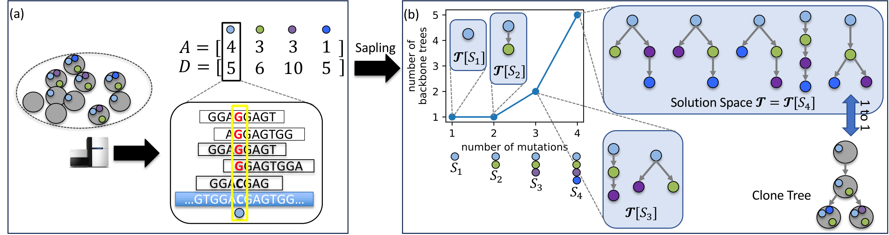

# Sapling

Sapling is a method that infers a small set of backbone trees on a smaller subset of mutations that collectively summarize the entire set of possible phylogenies.
Sapling can also grow a given backbone tree into a full phylogeny.

## Dependencies

Sapling requires the following python packages:
* numpy
* cvxopt

## I/O Format

Sapling takes a TSV(tab-separated values) file as input.
The first line includes the names of the columns, the following colunms are required:
- `sample_index` (0, 1, ..., m-1) for m samples
- `mutation_index` (0, 1, ..., n-1) for n mutations
- `var` variant reads
- `depth` total reads 
- `cluster_index`(optional) (0, 1, ..., k-1) for k clusters

[Here](example/example.tsv) is an example of input. 

The output is a text file.
The first line includes the the number backbone trees, in the format of "# $\tau$ backbone trees". Depending on the size $\ell$ of the set of mutations covered in the backbone trees, for the following $\tau \times \ell$ lines, each $\ell$ lines conatins a 
a tree.
More specifically, the first line of the $\ell$ lines includes the number mutations (mutation clusters) included in the backbone tree, and the following $\ell$-1 lines are descriptions of the edges of the tree in the format of "v1 v2" indicating that v1 is the unique parent of v2 in this tree. (-1 means germline)

## Usage instructions

#### Infer backbone trees (main program)

    Usage:
      python main.py [-h] -f str -o str -a float [-l int] [-t int] [-m]
    Where:
      -h
         Print a short help message
      -f str
         Input file
      -o str
         output file
      -a float
         rho: lower bound factor of likelihood
      -l int
         ell: size of the mutation set, will overide -t if provide any (default: None)
      -t int
         tau: upperbound of the number of backbone trees (default: 5)
      -m
         allow multiple evolutions from germline (GL)

Example command:
`python main.py -f example.tsv -o example.txt -a 0.9`

[The output](example/example.txt) of the above command on the example input.

#### Expand backbone trees into full trees (greedy expand)

    Usage:
        python greedy_expand.py [-h] -f str -o str -r str -a float [-m]
    Where:
      -h
         Print a short help message
      -f str
         Input file
      -o str
         output file
      -r str
         result file: output of the main program
      -a float
         rho: lower bound factor of likelihood
      -m
         allow multiple evolutions from germline (GL)

Example command
`python greedy_expand.py -f example.tsv -r example.txt -o example.full.txt -a 0.9`
[The output](example/example.full.txt) of the above command on the example input using the output generated above.
